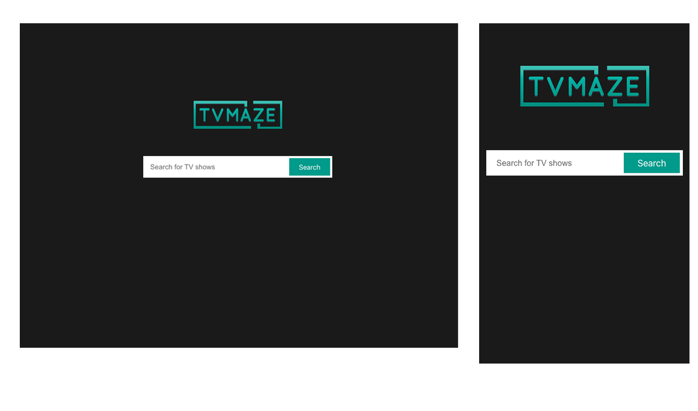
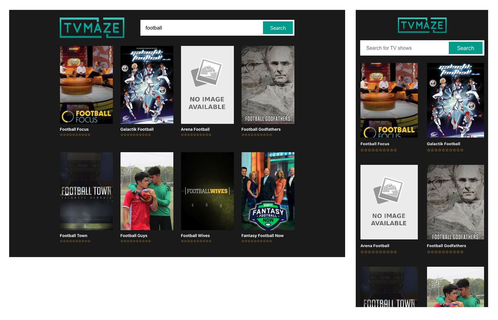
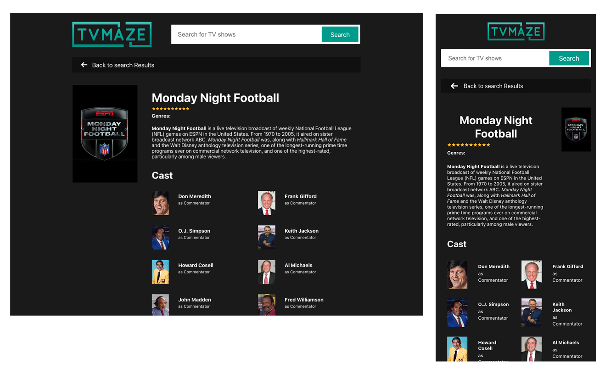

# Tv Series search
## [https://abhimax.github.io/tvmaze-tv-series-app-improved/]

## Features.
+ Search Shows
+ List available Shows based on the filter
+ Show detailed page with cast information
+ move front back with search result

## Home view

## Search result view

## Show detailed view

## Tech stack
### React, JavaScript, CSS Modules, Fetch API, Redux, SVG

## What I have done
- initialized the React app using npx create-react-app
- Study figma mocks and developed and tested atomic components
- composite components developments using atomic components
- Layout developments
- Pages  developments
- Hard corded show list and test all UI and fix errors
- Fixed responsive errors
- Add react routs and test with dummy data to plan dynamic routs
- add redux and replace dummy values with real data that fetched from DB
- set search value based on the search input result
- handled errors and loading states
- used custom hook to fetch data 
 
This project was bootstrapped with [Create React App](https://github.com/facebook/create-react-app).

## Available Scripts

In the project directory, you can run:

### `npm start`

Runs the app in the development mode.\
Open [http://localhost:3000](http://localhost:3000) to view it in your browser.

The page will reload when you make changes.\
You may also see any lint errors in the console.

### `npm test`

Launches the test runner in the interactive watch mode.\
See the section about [running tests](https://facebook.github.io/create-react-app/docs/running-tests) for more information.

### `npm run build`

Builds the app for production to the `build` folder.\
It correctly bundles React in production mode and optimizes the build for the best performance.

The build is minified and the filenames include the hashes.\
Your app is ready to be deployed!

See the section about [deployment](https://facebook.github.io/create-react-app/docs/deployment) for more information.

### `npm run eject`

**Note: this is a one-way operation. Once you `eject`, you can't go back!**

If you aren't satisfied with the build tool and configuration choices, you can `eject` at any time. This command will remove the single build dependency from your project.

Instead, it will copy all the configuration files and the transitive dependencies (webpack, Babel, ESLint, etc) right into your project so you have full control over them. All of the commands except `eject` will still work, but they will point to the copied scripts so you can tweak them. At this point you're on your own.

You don't have to ever use `eject`. The curated feature set is suitable for small and middle deployments, and you shouldn't feel obligated to use this feature. However we understand that this tool wouldn't be useful if you couldn't customize it when you are ready for it.

## About the task

The assignment is to create a web application that makes it possible for a user
to search for information about TV Series using the TV maze API. The TV maze
API has a public API which can be used for this assignment, and you can find
information about it here: [https://www.tvmaze.com/api]
The project should show the search results in a list and allow the user to see
more information about the show in another view.
The expected time frame for this assignment is about ~5 hours. Try to limit
your work to that timeframe and document in a readme file what you would
have done if you had more time.
The web application will be judged according to the code readability and
structure.

### Figma Sketches
Feel free to use the sketches found on the link below as the visual look of the
web application.

[https://www.figma.com/file/WXw4DO16XTJ0Wknr1l6p6J/Sketch-TV-Maze?node-id=0%3A1&t=LrqxLjAO2Z9Ly6KN-1]

### Requirements
The web application must include the “required” requirements. Add the “Nice to have” requirements if time permits. Before you start, read through the whole list so you get a good understanding on what to build.

### Required
- The web application should be responsive and work on both mobile and desktop.
- The web application must work on the latest version of the browsers Chrome, Firefox and Edge.
- The web application should have two views, one for detailed information and one for search and result.

- The repository of the web application must contain documentation on how to run the application.
- The web application should be written in JavaScript or TypeScript and in the framework of your choice.

### Nice to have
- The web application is written in TypeScript.
- The web application is written in ReactJS
- The web application is written without CSS libraries and frameworks.
- The web application should give the end user feedback concerning errors or when the connection to the API is slow. For example, when they have a slow internet connection.
- The web application should have routing set up in such way that the end users can send direct links to detailed information about a certain TV show.
- The project should have tests.
- If time permits, feel free to add what you think is missing from the application.

